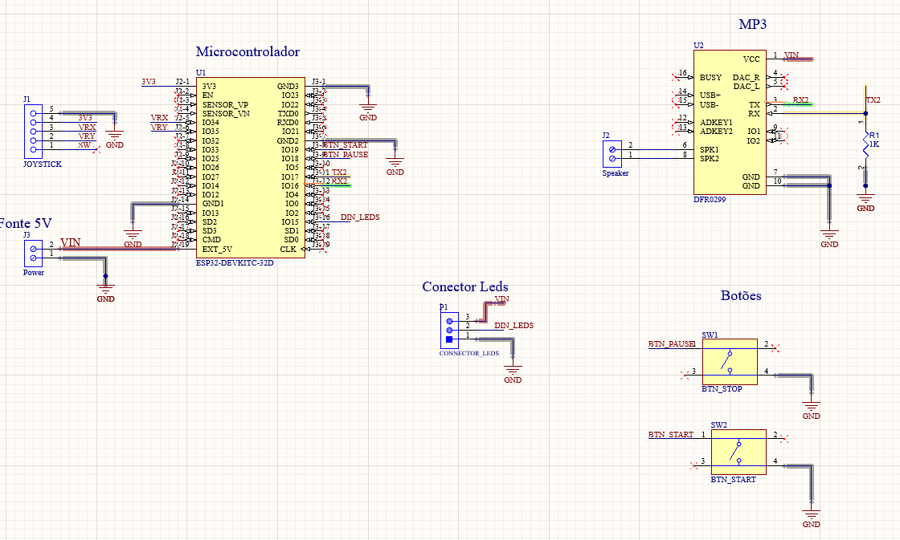

# Projeto-Oficina

<!DOCTYPE html>
<html>
<head>
  <meta charset="UTF-8">
 
</head>
<body>
  <h3>Projeto de oficina com o uso de LEDs endereçáveis, esp32, joystick e display 16x2 i2c</h3>
  <h3>Visão Geral do Projeto</h3>
  <ul>
    <li><strong>Nome do Projeto:</strong> Projeto oficina</li>
    <li><strong>Nome da IDE:</strong> arduino ide</li>
    <li><strong>Nome da linguagem:</strong> C/ C++</li>
    <li><strong>Nome do Microcontrolador:</strong>ESP32</li>
    <li><strong>Nome da disciplina:</strong> Oficina</li>
    <li><strong>Descrição:</strong>Implementação de jogo utilizando o display endereçavel WS2812 como tela com 16 linhas e 8 colunas, uso do joystick para movimentação de peças e botões para pausar e iniciar o jogo. </li
  </ul>
  
  <h3>Folhas de desenho</h3>
    <ul>
    <li>  <h3>Esquemático</h3>
  
      </li>
    </ul>
 
  
</body>
</html>
